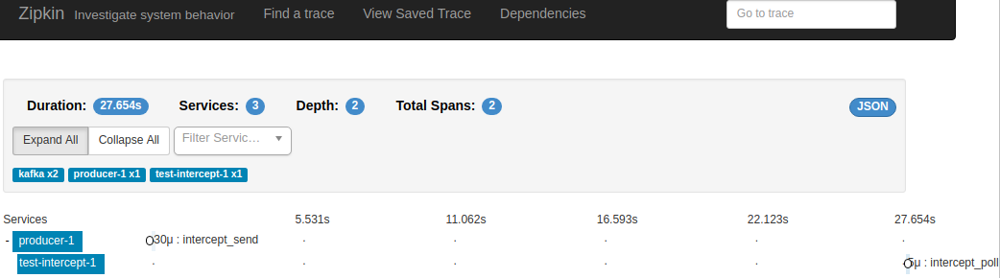

# [WIP] Brave Kafka Interceptors

Instrumentation to create traces from Kafka Clients (e.g. Consumer, Producer)
using Interceptors (see [here](https://kafka.apache.org/0100/javadoc/org/apache/kafka/clients/producer/ProducerInterceptor.html)
and [here](https://kafka.apache.org/0100/javadoc/org/apache/kafka/clients/consumer/ConsumerInterceptor.html)).

## Installation

### Producer Interceptor

Add Interceptor to Producer Configuration:

```java
    producerConfig.put(ProducerConfig.INTERCEPTOR_CLASSES_CONFIG, Collections.singletonList(TracingProducerInterceptor.class));
```

### Consumer Interceptor

```java
    consumerConfig.put(ConsumerConfig.INTERCEPTOR_CLASSES_CONFIG, Collections.singletonList(TracingConsumerInterceptor.class));
```

### Configuration

| Key | Value |
|-----|-------|
| `zipkin.api.url` | URL where Zipkin API is deployed. If not present, `zipkin.bootstrap.servers` is used. |
| `zipkin.bootstrap.servers` | Bootstrap Servers list to send Spans. if not present, `bootstrap.servers` (Kafka Client property) is used. |
| `zipkin.local.service_name` | Application Service name used to tag span. If not present, and producer, `client.id` will be used. If not present and consumer, `group.id` is used. |
| `zipkin.remote.service_name` | Remote Service to assign to Kafka. If not present, `"kafka"` is used.|

### How to test it

Start Docker Compose [docker-compose.yml](blob/master/docker-compose.yml)

```
docker-compose up -d
```

In `src/test/io/github/jeqo/brave/kafka/interceptors/examples`, a Producer and Consumer is placed to test interceptors.

